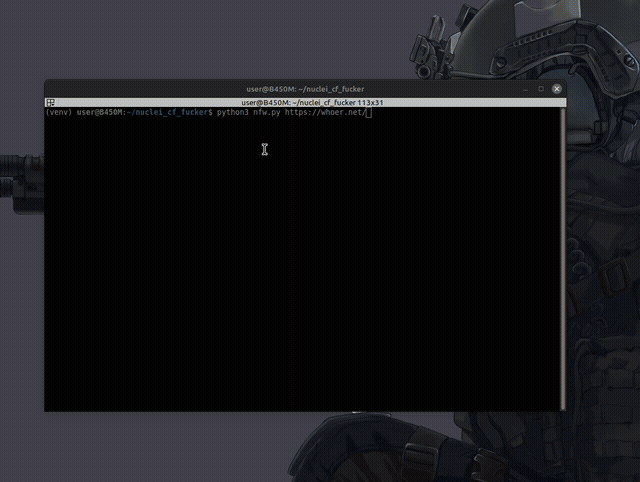

# nfw — nuclei_fuck_waf

Bypass Cloudflare and other WAFs for Nuclei by stealing real browser fingerprints. Solve the challenge once, scan freely.



## Principle

1. **Open** target in real Chrome
2. **Solve** CAPTCHA/challenge manually
3. **Steal** cookies, User-Agent, platform info
4. **Feed** stolen fingerprint to Nuclei
5. **Scan** like a legit user

WAF sees real browser → lets you through.

## Install

```bash
Need: Python 3.8+, Chrome/Chromium, Nuclei
python3 -m venv venv
source venv/bin/activate
pip install nodriver

usage:
python3 nfw.py https://target.com
python3 nfw.py https://target.com -severity high -tags cve

First arg = URL, rest goes to Nuclei.
